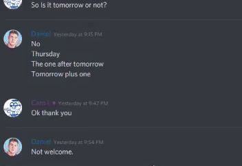

## Info
A Discord bot that replys with an image of hoes mad when a user curses.
And also &help. For version number and my username.

## Example

## Install
Simply extract into a folder and open in a terminal.
Open "auth.json" and replace "TOKEN" with the token that can be found at your 
>Developers Portal>YOUR BOT>Bot>Reveal

## Prerequisites
- NodeJS
- A discord bot that has be setup at [here](https://discord.com/developers/applications)
## Run
> node .
